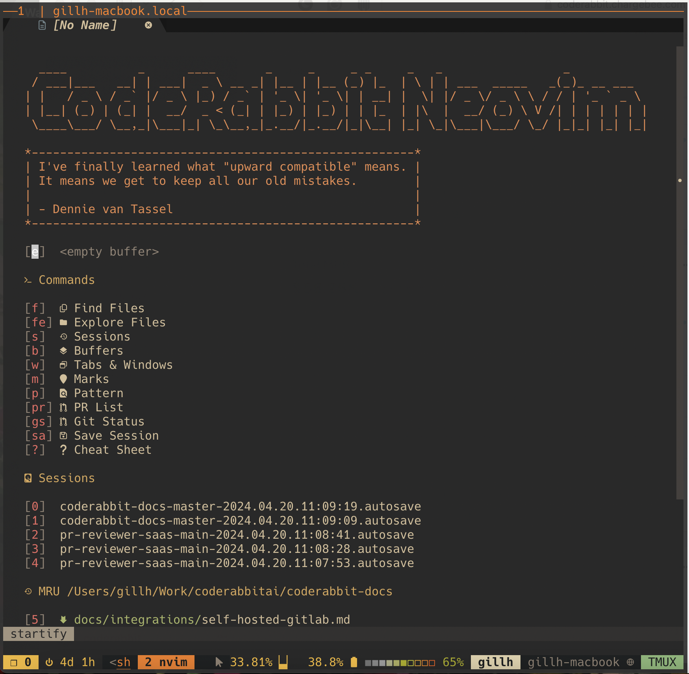
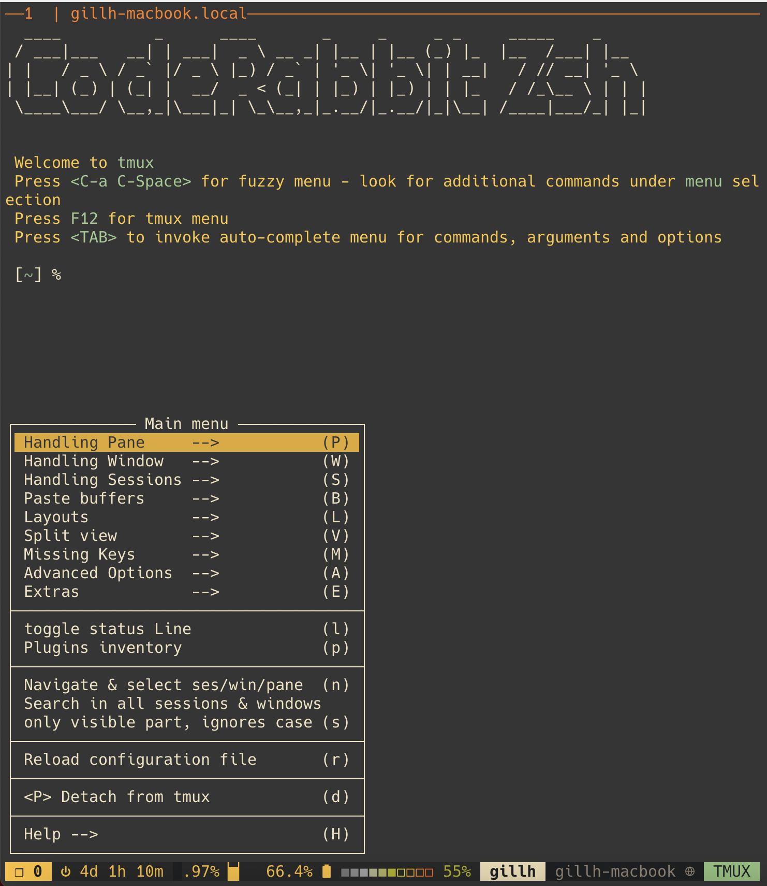
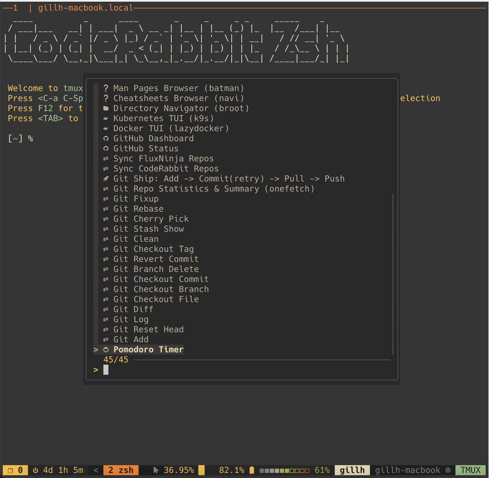

# FluxNinja Dotfiles



## Introduction

Welcome to FluxNinja optimized development environment that is well integrated
with our stack. Please join discussion channel on
[Slack](https://fluxninja.slack.com/channels/C03C2GKT2JF).

## Setup

We use [chezmoi](https://www.chezmoi.io) to manage FluxNinja dotfiles in your
home directory.

### Automatic Setup

```
/bin/bash -c "$(curl -fsSL https://raw.githubusercontent.com/fluxninja/dotfiles/master/sw/assets/executable_install.sh)"
```

### Manual Setup

```
cd $HOME
chezmoi init git@github.com:fluxninja/dotfiles.git
# show diff of changes that will be made
chezmoi diff
# If you are happy with the changes, apply away!
chezmoi apply -v
```

Please close and reopen the terminal to trigger first time install/updates.

Recommend using `GitHub CLI` for authenticating with GitHub. Run
`gh auth login`. Alternatively, add
[SSH key to your GitHub account](https://docs.github.com/en/authentication/connecting-to-github-with-ssh).

## Git setup

### Username and local settings

Provide username and email address by creating `.gitconfig_local` e.g.

```
[user]
  name = Harjot Gill
  email = harjot.gill@fluxninja.com
[github]
   user = <github user name>
   token = <personal access token>
```

You can generate
[personal access token](https://docs.github.com/en/authentication/keeping-your-account-and-data-secure/creating-a-personal-access-token)
for GitHub in order to use HTTP API. Also, it's useful to add this token to your
`$HOME/.netrc` file. Run -
`echo 'machine api.github.com login <user> password <token>' >> $HOME/.netrc`

### GitHub org cloning script

To clone FluxNinja, run: `gh_clone_all.sh fluxninja $HOME/work`. This step is
performed automatically on installation.

### Git pull all repos script

To update all repos in a directory, run: `pull_all.sh $HOME/work/fluxninja`.
This step is performed automatically on auto-updates.

## Preparing your terminal

- **Nerd fonts**: Please enable a nerd font such as `Hack Nerd Font` in your
  terminal profile to see icons properly when using vim/nvim in terminal mode.
- **Terminal colors**: See the section about [colors](#colors).

## Homebrew

Homebrew is the default package manager for this environment. You can provide
private packages by adding them to: `$HOME/.brew_local`

## Autoupdates

This environment is set to autoupdate every 7 days by default. You can trigger
autoupdates manually by calling `autoupdate.zsh --force` You can provide custom
autoupdate commands by adding them to: `$HOME/.autoupdate_local.zsh`

## zshrc

You can provide additional zshrc settings by adding them to:
`$HOME/.zshrc_local`


### Features

- Fuzzy menus: Fuzzy menus are available for command completion (press `TAB`)
  menus and command history (press `^r`).
- Vi mode: Press `ESC` to enter Vi `NORMAL` mode. Cool tip - while in normal
  mode, press `vv` to switch to visual mode (it will open `nvim` editor) and in
  that mode you can use GitHub Copilot to build sophisticated commands using AI!
- Prompt flags: Type `yazpt_explain_git` to understand meaning of various flags
  in the prompt.
- Forgit: You can use `forgit` as an interactive frontend for various git
  commands. E.g. try `git forgit log`.
- iTerm2 integration: On macOS, please install iTerm2 shell
  [integration](https://iterm2.com/documentation-shell-integration.html) to use
  nice features such as navigating marks in prompt.

## tmux





`tmux` sessions are automatically started as part of `.zshrc` execution. You
will be shown an option to join an existing detached session if they exist,
otherwise a new session will be created and attached to.

### Features

- Prefix: `C-a` or `C-b`
- Fuzzy menu: Press `C-a C-Space` to access fuzzy menu for quick tmux management
  and shortcuts to various commands.
- tmux menu: Press `F12` to access tmux session/window/pane management menu.
- Nested tmux sessions (e.g. remote ssh): Press `F1` to suspend/unsuspend local
  tmux.
- [Smug](https://github.com/ivaaaan/smug): Define and orchestrate tmux sessions
  with smug. e.g. use smug to start/stop local dev Kubernetes cluster and so on.
- Fuzzy search tmux terminal buffer: Press `C-a C-/`
- Vi bindings are enabled in tmux copy mode
- Facebook PathPicker: Press `C-a C-P` to select any line from scrollback buffer
  (e.g. git status) and use those in another command.
- Urlview: Press `C-a C-U` to select any url in scrollback buffer and open in
  browser.

## Vim

This environment is highly tuned towards providing a modern neovim/vim setup for
development using modern languages such as Golang, Typescript etc.


### vimrc

You can provide additional vimrc settings by adding them to:
`$HOME/.vimrc_local`. You can also use FuzzyMenu (`<space><space>`) to tweak and
persist local settings. In addition, you can provide additional vim plugins by
adding them to `$HOME/.vimrc_plugins`.

Several colorschemes are bundled and `gruvbox` is chosen by default. You can
override colorscheme by providing `let colorscheme = <colorscheme>` in your
`.vimrc_local` file.

See `.vimrc` file for available colorschemes.

### GUI

Use the command `nv` to launch vim GUI. It maps to `vimr` on MacOS and
`neovim-qt` on Linux

### Discoverability of commands and plugins

- Landing page for new tabs contains several useful links that help with
  discoverability.
- Press `<space><space>` (double space) or `Shift + LeftMouse` click to open a
  contextual FuzzyMenu for the word under cursor or selection.

### AI-based autocompletion

- GitHub Copilot - Type `:Copilot setup` in Vim to setup.
- Tabnine - Type `:CocCommand tabnine.openHub` in Vim to setup. Ask for Tabnine
  account on FluxNinja Slack.

## Colors

Unlike nvim which allows setting themes easily via `.vimrc_local`, color themes
for terminal interface are spread across multiple settings.

- **Terminal theme** -
  - macOS: For iTerm2, the option will be provided to install bundled profile
    that contains font/color settings. If you do not wish to install the
    profile, then the colors will be set via terminal escape codes unless
    `SET_TERMINAL_COLORS` is set to `false` in your `.zshrc_local`.
  - Linux: Colors will be set automatically using terminal escape codes unless
    `SET_TERMINAL_COLORS` is set to `false` in your `.zshrc_local`.
    Alternatively, you can install default color profile using
    `$HOME/sw/assets/install_gruvbox.sh`. Make sure to set `SET_TERMINAL_COLORS`
    to `false` in your `.zshrc_local` if you would like to use terminal's color
    profiles.
- tmux theme - See `.tmux.conf.settings` for example configuration and override
  it in your personal `.tmux.conf_local` file. The tmux theme configures the
  tmux status line and not the terminal itself.
- bat theme (cat replacement) - Environment variable `BAT_THEME` sets the theme.
  See `bat --list-themes` to get the list. You can override this theme in your
  `.zshrc_local` file. Bat is used extensively for fzf previews, git pager
  (delta), less command filter and so on.
- FZF colors - Get and source color schemes from
  [base16-fzf](https://github.com/fnune/base16-fzf) in your
  `$HOME/.zshrc_local`.
- LS_COLORS - We use [vivid](https://github.com/sharkdp/vivid) to set the
  themes. Run `vivid themes` to get the list. You can override this theme in
  your `.zshrc_local` file.
- Git pager - See `.gitconfig_themes` to see the available themes. You can
  override them in your local `.gitconfig_local`.
- Fast Syntax Highlighting (zsh) - You can run `fast-theme -l` to get the list.
  To set the theme, first, override `FAST_WORK_DIR` environment variable in your
  `.zshrc` and point it to `$HOME/.config/fsh_local`. Next, run
  `fast-theme <theme>` to switch the theme.

Note: Currently all these settings are configured to match `gruvbox-dark` color
palette. But it's pretty easy to override them to match `onedark` or
[Nord](https://www.nordtheme.com)

Bonus:

- Slack Gruvbox - Paste this in your DM to Slackbot and click the
  `Switch sidebar theme` button.
  ` gruvbox dark #282828,#3c3836,#ebdbb2,#1d2021,#3e313c,#ebdbb2,#689d6a,#fb4934`

## Managing `*_local` override files

You can use [vcsh](https://github.com/RichiH/vcsh) utility to version local
files and sync them across machines.
